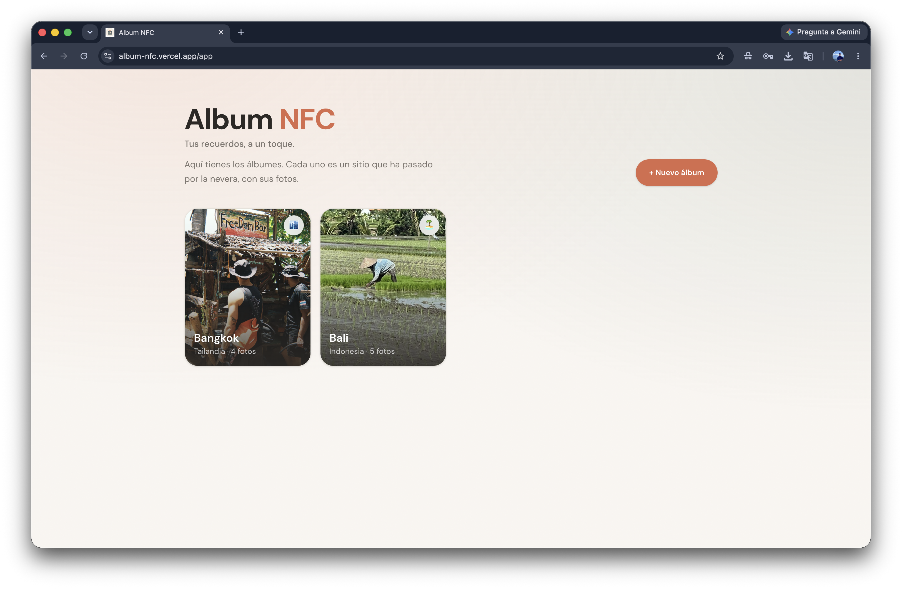
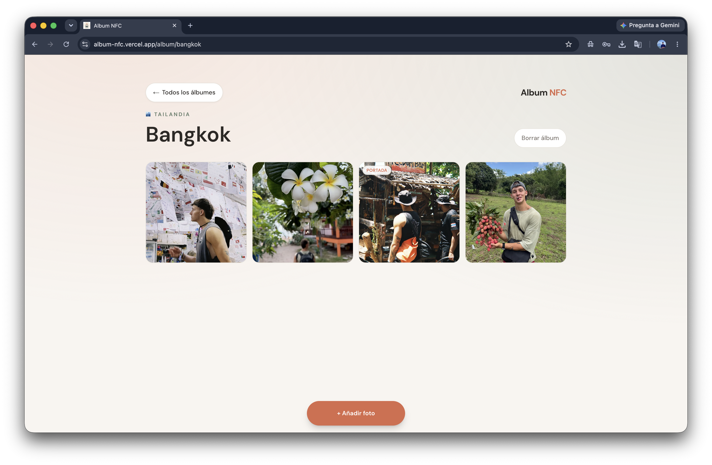
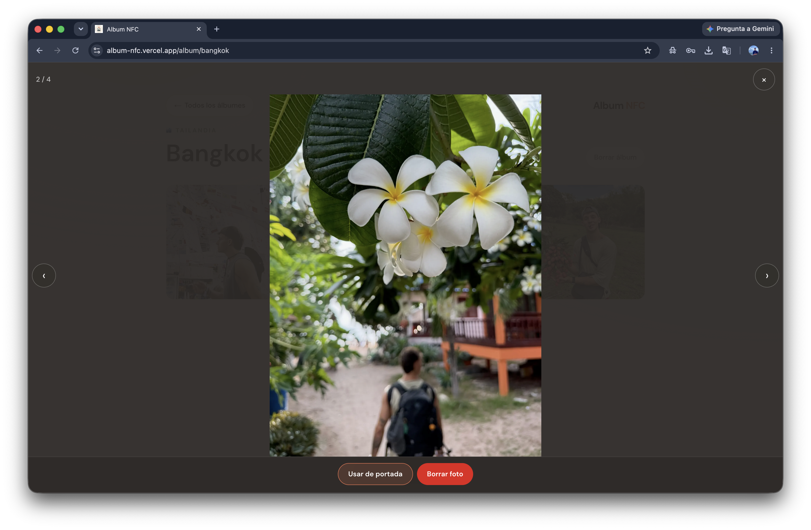
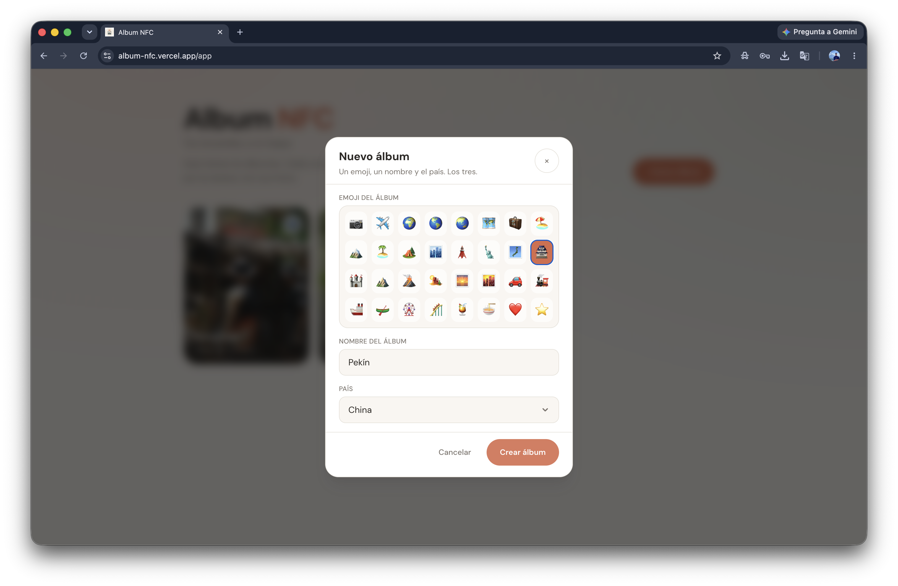
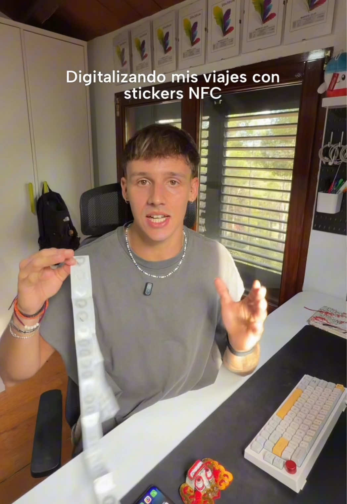
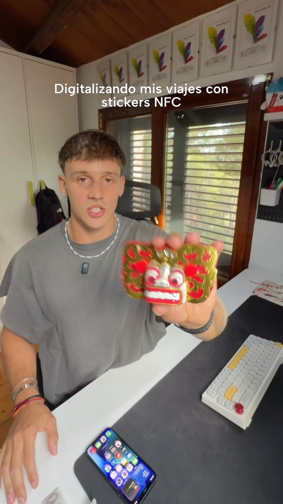

# Album NFC

<p align="center">
  
</p>

<p align="center">
  <strong>Album</strong> NFC — <em>Tus recuerdos, a un toque.</em>
</p>

<p align="center">
  WebApp que se abre al escanear una pegatina NFC: álbumes compartidos por países con fotos.<br />
  Sin login. Todo el contenido es público y editable por cualquiera.
</p>

<p align="center">
  <a href="https://github.com/marcasanova/WebApp-NFCs/blob/main/LICENSE"></a>
  
  
  
</p>

<p align="center">
  <a href="https://album-nfc.vercel.app/"><strong>Demo en vivo</strong></a>
  ·
  <a href="#inicio-rápido">Inicio rápido</a>
  ·
  <a href="SECURITY.md">Aviso de seguridad</a>
</p>

## Capturas

| `/app` — álbumes | Álbum |
| --- | --- |
|  |  |

| Lightbox | Crear álbum |
| --- | --- |
|  |  |

> Capturas desktop. Si el README se siente pesado, puedes sustituirlas por PNG más ligeros (~390 px de ancho). Ver [`docs/screenshots/README.md`](docs/screenshots/README.md).

## En vídeo

Dos vídeos donde cuento el proyecto. GitHub no permite embeds: toca la miniatura para abrir TikTok o Instagram.

| TikTok | Instagram |
| --- | --- |
| [](https://www.tiktok.com/@marc_casanova/video/7675024218152520982) | [](https://www.instagram.com/reel/DcHFC1GuVfd/) |

URLs en [`lib/videos.ts`](lib/videos.ts). Miniaturas README: [`docs/videos/`](docs/videos/README.md).

## Qué hace

1. **Landing** (`/`): presentación de Album NFC. Al escanear la pegatina se abre esta página.
2. **Álbumes** (`/app`): lista todos los álbumes (uno por destino / país), con portada o emoji.
3. **Álbum** (`/album/[slug]`): galería de fotos.
4. **Crear álbum**: emoji + nombre + país — los tres obligatorios.
5. **Subir fotos**: desde galería o cámara (`image/*`, máx. ~10 MB).
6. **Portada**: cualquier foto puede marcarse como portada desde el lightbox.
7. **Borrar**: cualquiera puede borrar álbumes o fotos (sin auth).

La pegatina NFC apunta a la **landing** (`/`) o a `/app`, no a un álbum concreto.

## Stack

- **Next.js 16** (App Router) · **React 19** · **TypeScript**
- **Tailwind CSS 4** · **Motion** (animaciones)
- **Supabase** (Postgres + Storage)

## Inicio rápido

```bash
git clone https://github.com/marcasanova/WebApp-NFCs.git
cd WebApp-NFCs
npm install
cp .env.example .env.local
```

1. Crea un proyecto en [Supabase](https://supabase.com).
2. En **Project Settings → API**, copia la Project URL y la `anon` / publishable key a `.env.local`.
3. En **SQL Editor**, pega y ejecuta [`supabase/migrations/001_albums_and_media.sql`](supabase/migrations/001_albums_and_media.sql).  
   Ese script crea tablas, RLS y el bucket de Storage `media` con políticas abiertas del MVP.
4. Arranca la app:

```bash
npm run dev
```

Abre [http://localhost:3000](http://localhost:3000) (landing). La herramienta de álbumes está en [http://localhost:3000/app](http://localhost:3000/app).

### Variables de entorno

| Variable | Descripción |
| --- | --- |
| `NEXT_PUBLIC_SUPABASE_URL` | URL del proyecto (`https://xxxx.supabase.co`) |
| `NEXT_PUBLIC_SUPABASE_ANON_KEY` | Anon / publishable key (nunca la service role) |

Plantilla: [`.env.example`](.env.example).

## Scripts

| Comando | Descripción |
| --- | --- |
| `npm run dev` | Servidor de desarrollo |
| `npm run build` | Build de producción |
| `npm run start` | Servir el build |
| `npm run lint` | ESLint |

## Estructura

```text
app/                 App Router (páginas y Server Actions)
components/          UI (galería, lightbox, crear álbum, …)
lib/                 Datos, slug, países, clientes Supabase
supabase/migrations/ SQL reproducible para forks
docs/                Logo, capturas, vídeos y checklist de GitHub
contexto/            Reglas y skills para agentes de código
AGENTS.md            Instrucciones para asistentes de IA
```

Vídeos del proyecto: [`lib/videos.ts`](lib/videos.ts). Miniaturas README: [`docs/videos/`](docs/videos/README.md).
## Aviso de seguridad (importante)

Este MVP es **intencionalmente abierto**: cualquiera puede crear y borrar álbumes y fotos. Las políticas RLS y de Storage permiten acceso anónimo completo.

- No lo uses con fotos privadas ni datos sensibles.
- Cada fork / deploy debe usar **su propio** proyecto Supabase.
- Detalle: [`SECURITY.md`](SECURITY.md).

## Contribuir

Lee [`CONTRIBUTING.md`](CONTRIBUTING.md). Issues y PRs son bienvenidos dentro del alcance del MVP.

Checklist para dueños del repo (description, topics, social preview): [`docs/GITHUB_SETUP.md`](docs/GITHUB_SETUP.md).

## Licencia

[MIT](LICENSE) © marcasanova

---

### Apéndice: Supabase MCP (Cursor)

Solo si desarrollas con Cursor y quieres el MCP de Supabase:

1. Edita [`.cursor/mcp.json`](.cursor/mcp.json) y sustituye `YOUR_PROJECT_REF` por el ref de tu proyecto.
2. Cursor → **Settings → Tools & MCP** → autentica Supabase (OAuth).

No es necesario para clonar, configurar ni ejecutar la app.

### Apéndice: agentes de código

[`AGENTS.md`](AGENTS.md) y [`contexto/`](contexto/) orientan a asistentes de IA. El onboarding humano es este README.
