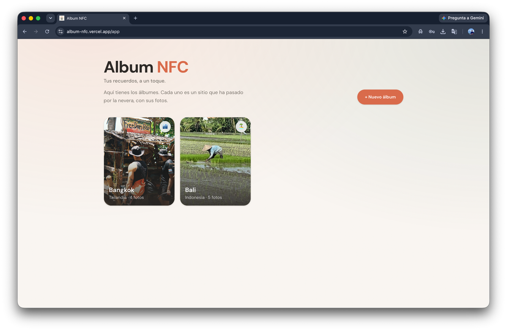
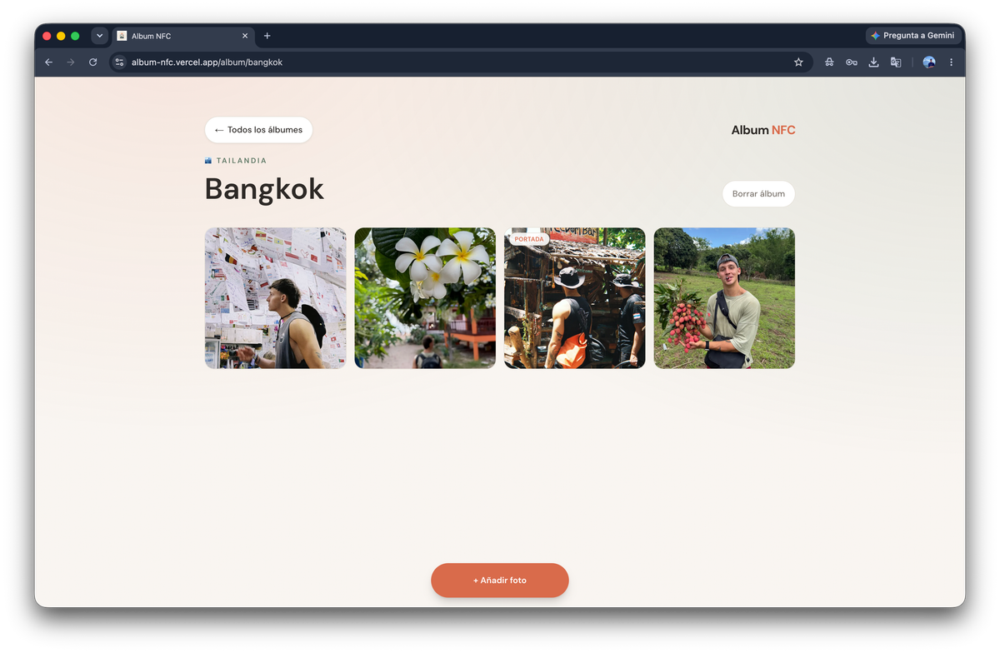
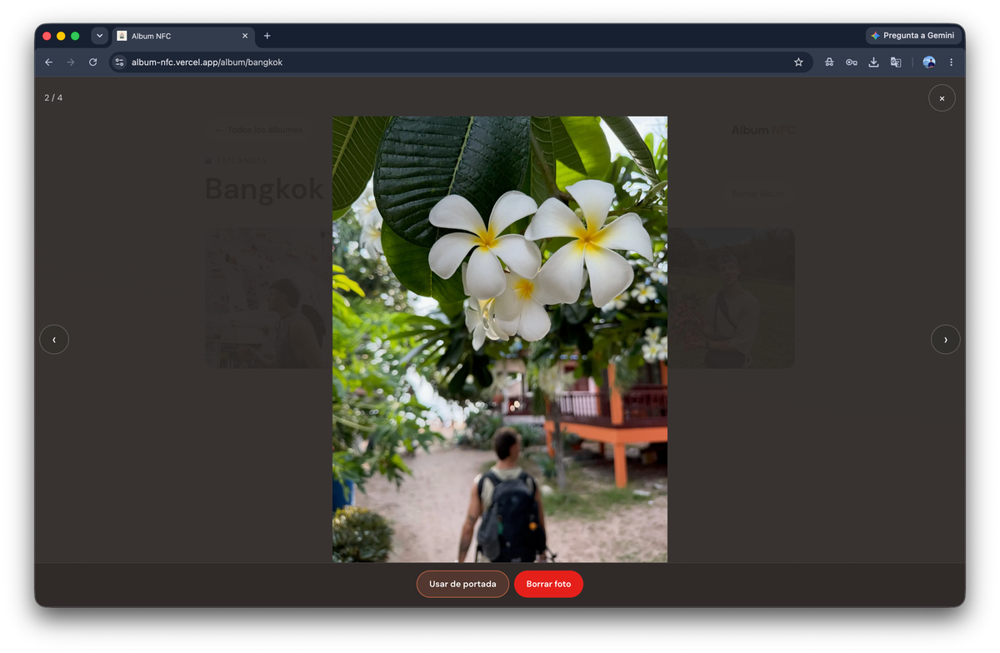
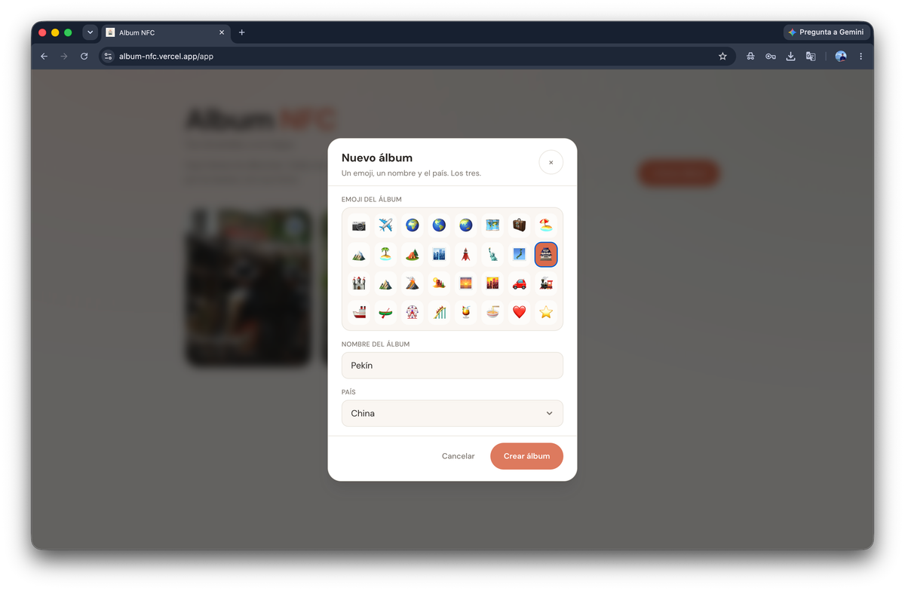
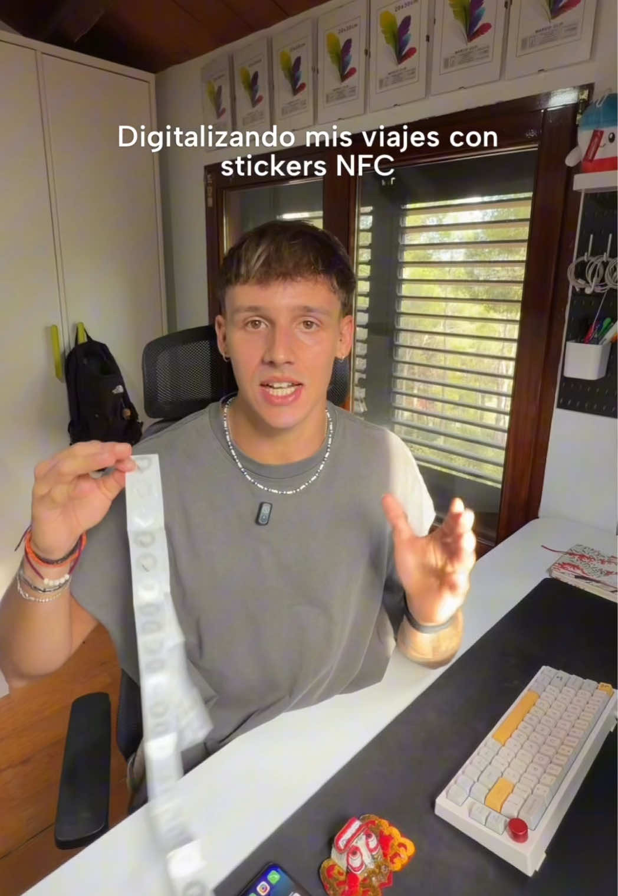
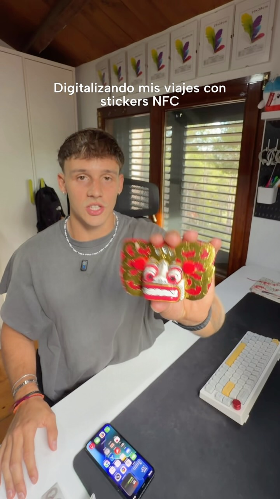

<table align="center">
  <tr>
    <td align="center">
      
      <h1>Album NFC</h1>
      <p><strong>Album</strong> NFC — <em>Tus recuerdos, a un toque.</em></p>
      <p>
        WebApp que se abre al escanear una pegatina NFC: álbumes compartidos por países con fotos.<br />
        Sin login. Todo el contenido es público y editable por cualquiera.
      </p>
      <p>
        
        
        
        
      </p>
      <p>
        <a href="https://album-nfc.vercel.app/"><strong>Demo en vivo</strong></a>
        ·
        <a href="#inicio-rápido">Inicio rápido</a>
        ·
        <a href="SECURITY.md">Aviso de seguridad</a>
      </p>
    </td>
  </tr>
</table>

## Capturas

| `/albums` — álbumes | Álbum |
| --- | --- |
|  |  |

| Lightbox | Crear álbum |
| --- | --- |
|  |  |

## En vídeo

Dos vídeos donde cuento el proyecto. GitHub no permite embeds: toca la miniatura para abrir TikTok o Instagram.

| TikTok | Instagram |
| --- | --- |
| <a href="https://www.tiktok.com/@marc_casanova/video/7675024218152520982"></a> | <a href="https://www.instagram.com/reel/DcHFC1GuVfd/"></a> |

URLs en [`lib/videos.ts`](lib/videos.ts). Miniaturas en `public/videos/`.

## Qué hace

1. **Landing** (`/`): presentación de Album NFC. Al escanear la pegatina se abre esta página.
2. **Álbumes** (`/albums`): lista todos los álbumes (uno por destino / país), con portada o emoji.
3. **Álbum** (`/album/[slug]`): galería de fotos.
4. **Crear álbum**: emoji + nombre + país — los tres obligatorios.
5. **Subir fotos**: desde galería o cámara (`image/`*, máx. ~10 MB).
6. **Portada**: cualquier foto puede marcarse como portada desde el lightbox.
7. **Borrar**: cualquiera puede borrar álbumes o fotos (sin auth).

La pegatina NFC apunta a la **landing** (`/`) o a `/albums`, no a un álbum concreto.

## Stack

- **Next.js 16** (App Router) · **React 19** · **TypeScript**
- **Tailwind CSS 4** · **Motion** (animaciones)
- **Supabase** (Postgres + Storage)


## Inicio rápido

```bash
git clone https://github.com/marcasanova/WebApp-NFCs.git
cd WebApp-NFCs
npm install
cp .env.example .env.local
```

1. Crea un proyecto en [Supabase](https://supabase.com).
2. En **Project Settings → API**, copia la Project URL y la `anon` / publishable key a `.env.local`.
3. En **SQL Editor**, pega y ejecuta `[supabase/migrations/001_albums_and_media.sql](supabase/migrations/001_albums_and_media.sql)`.
  Ese script crea tablas, RLS y el bucket de Storage `media` con políticas abiertas del MVP.
4. Arranca la app:

```bash
npm run dev
```

Abre [http://localhost:3000](http://localhost:3000) (landing). La herramienta de álbumes está en [http://localhost:3000/albums](http://localhost:3000/albums).

### Variables de entorno


| Variable                        | Descripción                                    |
| ------------------------------- | ---------------------------------------------- |
| `NEXT_PUBLIC_SUPABASE_URL`      | URL del proyecto (`https://xxxx.supabase.co`)  |
| `NEXT_PUBLIC_SUPABASE_ANON_KEY` | Anon / publishable key (nunca la service role) |


Plantilla: `[.env.example](.env.example)`.

## Scripts


| Comando         | Descripción            |
| --------------- | ---------------------- |
| `npm run dev`   | Servidor de desarrollo |
| `npm run build` | Build de producción    |
| `npm run start` | Servir el build        |
| `npm run lint`  | ESLint                 |


## Estructura

```text
app/                 App Router (páginas y Server Actions)
components/          UI (galería, lightbox, crear álbum, …)
lib/                 Datos, slug, países, clientes Supabase
supabase/migrations/ SQL reproducible para forks
public/              Marca, capturas, landing, vídeos e iconos sociales
docs/                Documentación del repo (sin assets gráficos)
contexto/            Reglas y skills para agentes de código
AGENTS.md            Instrucciones para asistentes de IA
```

Vídeos del proyecto: `[lib/videos.ts](lib/videos.ts)`. Assets gráficos: `[public/](public/)` (detalle en `[docs/README.md](docs/README.md)`).

## Aviso de seguridad (importante)

Este MVP es **intencionalmente abierto**: cualquiera puede crear y borrar álbumes y fotos. Las políticas RLS y de Storage permiten acceso anónimo completo.

- No lo uses con fotos privadas ni datos sensibles.
- Cada fork / deploy debe usar **su propio** proyecto Supabase.
- Detalle: `[SECURITY.md](SECURITY.md)`.


## Contribuir

Lee `[CONTRIBUTING.md](CONTRIBUTING.md)`. Issues y PRs son bienvenidos dentro del alcance del MVP.

## Licencia

[MIT](LICENSE) © marcasanova

---


### Apéndice: Supabase MCP (Cursor)

Solo si desarrollas con Cursor y quieres el MCP de Supabase:

1. Edita `[.cursor/mcp.json](.cursor/mcp.json)` y sustituye `YOUR_PROJECT_REF` por el ref de tu proyecto.
2. Cursor → **Settings → Tools & MCP** → autentica Supabase (OAuth).

No es necesario para clonar, configurar ni ejecutar la app.

### Apéndice: agentes de código

`[AGENTS.md](AGENTS.md)` y `[contexto/](contexto/)` orientan a asistentes de IA. El onboarding humano es este README.